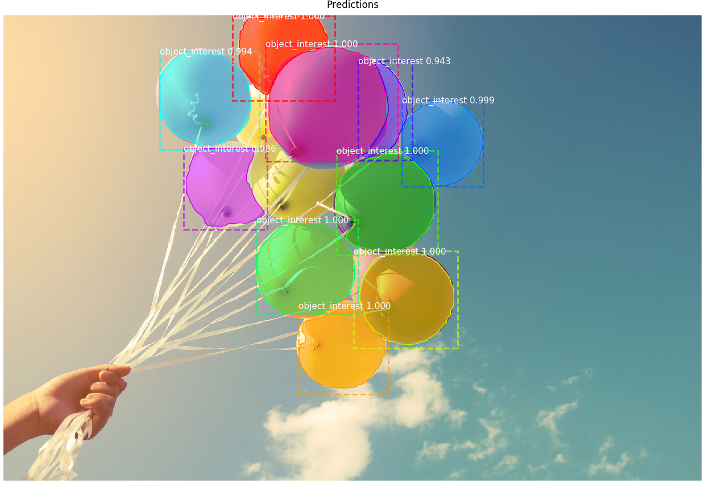
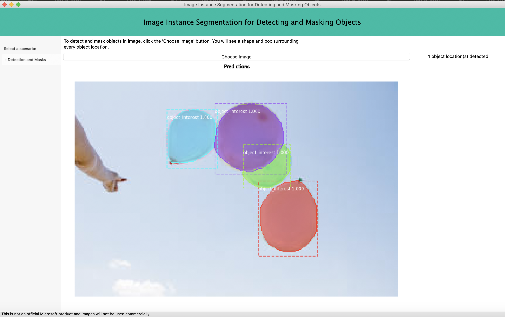

# A Python Desktop App for Instance Segmentation with MaskRCNN


<div align="right"><a href="https://nypost.com/2019/01/20/releasing-balloons-in-east-hampton-could-cost-you-jail-time/" target="_blank">Source</a></div>

A MaskRCNN algorithm is used to detect the car damage (output of the model is class, bounding box and mask).

## Running the sample

> Note: If on NVIDIA GPU with CUDA, you can change `tensorflow` to `tensorflow-gpu` in the `requirements.txt` and `setup.py` to take advantage of GPU acceleration.

A sample desktop application is also provided in the `sample` directory.

Currently it supports the following combination: [Python 3](https://www.python.org/downloads/) + [wxPython 4+](https://pypi.python.org/pypi/wxPython)

P.S. WxPython 3 does not support Python 3 by design.

1. Train a MaskRCNN Keras model according to https://github.com/matterport/Mask_RCNN (take a look at `maskrcnn_detect/custom.py` in this repo as well) or use a prebuilt model from the releases page of the Matterport repo: https://github.com/matterport/Mask_RCNN/releases (try with balloon model as it is also 1 class).

2. Rename the model to `maskrcnn_model.h5` and place it in the `sample` folder so that `base.py` can find it.

2. To run the app do the following:

```bash
git clone https://github.com/michhar/maskrcnn-python-app.git
cd maskrcnn-python-app
pip install -r requirements.txt
pip install .
python sample
```
If the package is already installed, make sure to uninstall first.

`pip uninstall damage-detect -y`

then install as above.



## Troubleshooting

1. __This program needs access to the screen. Please run with a Framework build of python, and only when you are logged in on the main display of your Mac.__.  See:  https://stackoverflow.com/questions/48531006/wxpython-this-program-needs-access-to-the-screen

For other errors:

2.  Try `pythonw` instead of `python` or `python3`.
3.  Try a `venv` virtual environment.
3.  Try using the system Python 3.
4.  Upgrade pip (`pip install --upgrade pip`).

## Contributing

Contributions are welcome. Feel free to file issues and pull requests on the repo and we'll address them as we can. Learn more about how you can help on our [Contribution Rules & Guidelines](/CONTRIBUTING.md).


## Credits

* Much of the code and idea came from https://github.com/microsoft/Cognitive-Face-Python
* Images used to train the model came from Google image search
* The ML model in association with this repo will not be used for commercial purposes.  It is purely for demo.


