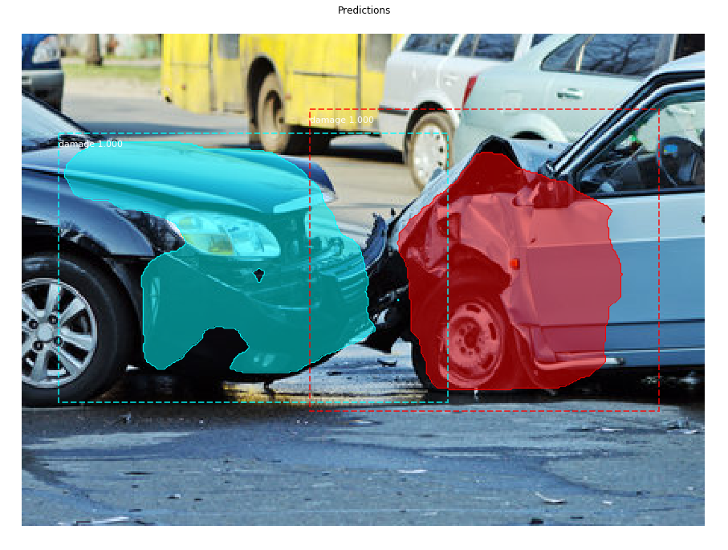
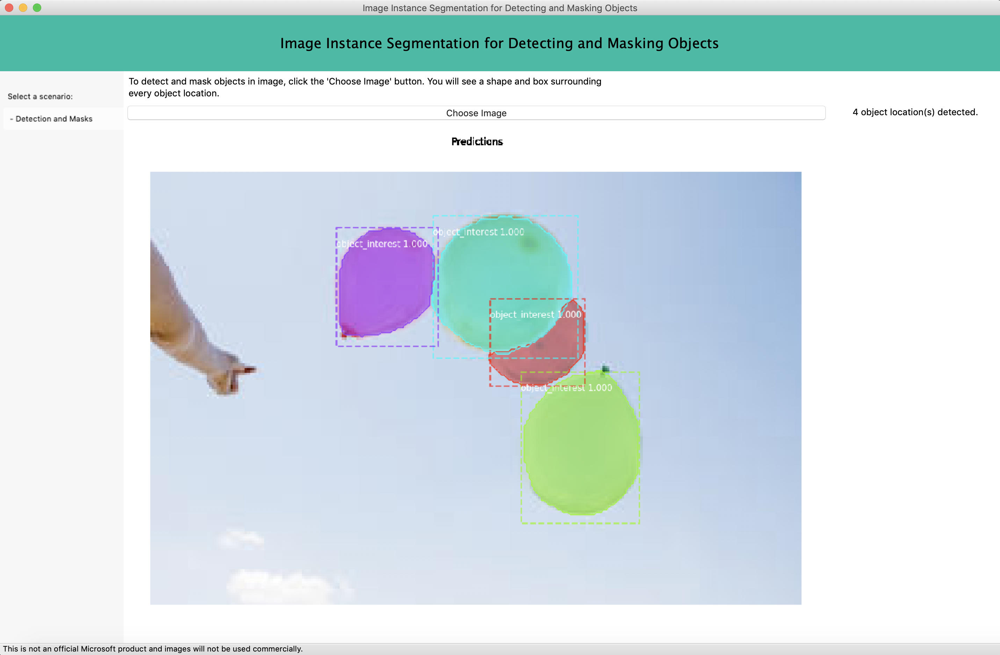

# Detecting Car Damage with Instance Segmentation



A MaskRCNN algorithm is used to detect the car damage (output of the model is class, bounding box and mask).


## Getting started

For a fresh install, from the base directory of the repo, in a terminal, install the `damage-detect` package from source code with:

`pip install .`

> To ensure the proper python, in case of issues, you can always use `python -m pip install .`.

Download and place the ML model in the `sample` directory.

If the package is already installed, make sure to unintall first.

`pip uninstall damage-detect -y`

then install as above.

## Running the sample

A sample desktop application is also provided in the `sample` directory.

Currently it support the following combination of prerequisites:

1. [Python 3](https://www.python.org/downloads/) + [wxPython 4](https://pypi.python.org/pypi/wxPython) **[Recommended]**
1. [Python 2](https://www.python.org/downloads/) + [wxPython 4](https://pypi.python.org/pypi/wxPython)
1. [Python 2](https://www.python.org/downloads/) + [wxPython 3](https://sourceforge.net/projects/wxpython/files/wxPython/3.0.2.0/)

P.S. WxPython 3 does not support Python 3 by design.

Then run the following:

```bash
git clone https://github.com/Microsoft/Cognitive-Face-Python.git
cd 
pip install -r requirements.txt
python sample
```

If an error occurs regarding control of the screen, try `pythonw` instead of `python`.  It may need to be installed.




## Running the unit tests

Run the following:

```bash
python setup.py test
```

## Contributing

We welcome contributions. Feel free to file issues and pull requests on the repo and we'll address them as we can. Learn more about how you can help on our [Contribution Rules & Guidelines](/CONTRIBUTING.md).


## Credits

* Much of the code and idea came from https://github.com/microsoft/Cognitive-Face-Python
* Images used to train the model came from Google image search
* The ML model in association with this repo will not be used for commercial purposes.  It is purely for demo.


